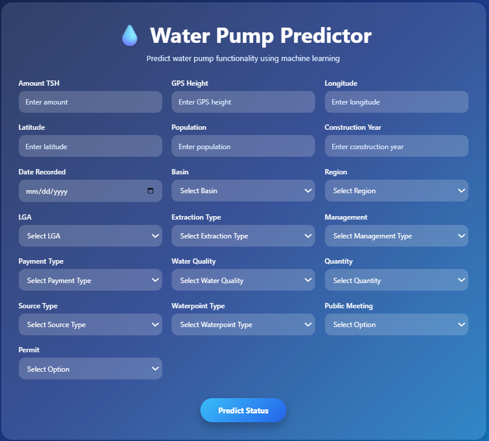
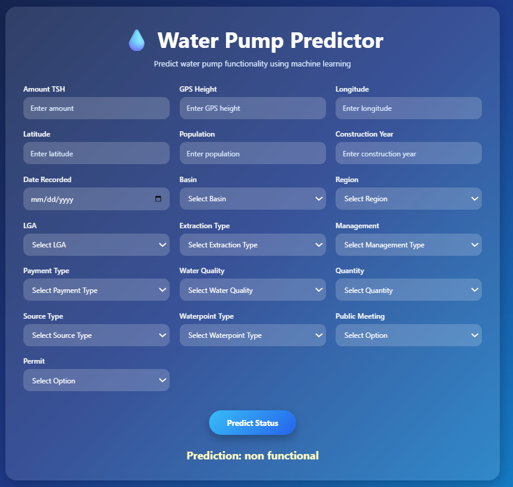

# 💧 Water Pump Status Prediction 💧

A Machine Learning web application that predicts the operational status of water pumps in Tanzania using historical pump data.

Built with **Python**, **Scikit-Learn**, **Flask**, **HTML**, and **CSS**.

---

# Demo

# Homepage



# Prediction



---

# Project Overview

Access to clean water is a major challenge in many regions. This project predicts whether a water pump is:

- ✅ Functional
- 🛠 Functional Needs Repair
- ❌ Non Functional

using machine learning based on technical, geographical, and management-related information.

The application allows users to enter pump information through a web interface and receive an instant prediction.

---

# Dataset

The project uses the **Pump it Up: Data Mining the Water Table** dataset from DrivenData.

The dataset contains information such as:

- GPS Coordinates
- Construction Year
- Population
- Basin
- Region
- LGA
- Water Quality
- Source Type
- Extraction Type
- Payment Type
- Management
- Permit Status
- Public Meeting Status
- Quantity

Target Variable:

- Functional
- Functional Needs Repair
- Non Functional

---

# Machine Learning Pipeline

The model was built using a Scikit-Learn Pipeline to ensure identical preprocessing during both training and prediction.

Pipeline Structure

```
Input Data
      │
      ▼
Feature Engineering
(create_pump_age)
      │
      ▼
ColumnTransformer
      │
      ├── StandardScaler
      └── OneHotEncoder
      │
      ▼
Logistic Regression
      │
      ▼
Prediction
```

The complete pipeline is serialized using **Joblib**, allowing the Flask application to load a single file for prediction.

---

# Feature Engineering

A custom transformer creates a new feature:

```
Pump Age = Recorded Year − Construction Year
```

This feature is generated automatically inside the pipeline during prediction.

Additional preprocessing includes:

- Date conversion
- Missing value handling
- Invalid construction year correction
- One-Hot Encoding
- Feature Scaling

---

# Technologies Used

- Python 3
- Flask
- Pandas
- NumPy
- Scikit-Learn
- Joblib
- HTML5
- CSS3

---

# Project Structure

```
water_pump_prediction/
│
├── app/
│   ├── app.py
│   ├── predictor.py
│   ├── templates/
│   │      └── index.html
│   └── static/
│
├── models/
│   └── water_pump_pipeline.joblib
│
├── notebooks/
│   └── model_training.ipynb
│
├── requirements.txt
│
├── README.md
│
└── .gitignore
```

---

# Installation

Clone the repository

```bash
git clone https://github.com/bosiredilan/water-pump-prediction.git
```

Navigate to the project

```bash
cd water-pump-prediction
```

Create a virtual environment

Windows

```bash
python -m venv venv
```

Activate it

Command Prompt

```bash
source venv\Scripts\activate
```

PowerShell

```powershell
venv\Scripts\Activate.ps1
```

Install dependencies

```bash
pip install -r requirements.txt
```

---

# Running the Application

Start Flask

```bash
python app.py
```

Open your browser

```
http://127.0.0.1:5000
```

Fill in the form and click **Predict Status**.

---

# Example Prediction

### Input

| Feature | Value |
|----------|------:|
| Amount TSH | 600 |
| GPS Height | 1200 |
| Population | 300 |
| Construction Year | 2008 |
| Basin | Lake Victoria |
| Region | Mwanza |

### Output

```
Prediction:
Functional
```

---

# Model

Algorithm:

- Logistic Regression

Pipeline Components:

- FunctionTransformer
- ColumnTransformer
- StandardScaler
- OneHotEncoder
- LogisticRegression

---


# 🚀 Deployment

This application is deployed using **Render**, but can also be deployed on platforms such as:

- Railway
- Heroku
- Azure App Service
- Google Cloud Run

## Deploying on Render

### 1. Push the project to GitHub

Initialize Git (if you haven't already):

```bash
git init
git add .
git commit -m "Initial commit"
```

Create a GitHub repository and push your project:

```bash
git remote add origin https://github.com/yourusername/water-pump-prediction.git
git branch -M main
git push -u origin main
```

---

### 2. Create a Web Service on Render

1. Log in to https://render.com
2. Click **New +**
3. Select **Web Service**
4. Connect your GitHub account
5. Choose the repository
6. Click **Connect**

---

### 3. Configure the Service

| Setting | Value |
|---------|-------|
| Environment | Python 3 |
| Build Command | `pip install -r requirements.txt` |
| Start Command | `gunicorn app:app` |

> **Note:** If your `app.py` is inside an `app/` folder, use:

```bash
gunicorn app.app:app
```

instead.

---

### 4. Environment Variables

No environment variables are required for this project.

---

### 5. Deploy

Click **Create Web Service**.

Render will automatically:

- Install dependencies
- Build the application
- Start the Flask server
- Provide a public URL

Example:

```
https://water-pump-prediction.onrender.com
```

---

# Project Files Required for Deployment

The repository should contain:

```
water_pump_prediction/
│
├── app.py
├── predictor.py
├── models/
│   └── water_pump_pipeline.joblib
├── templates/
│   └── index.html
├── static/
├── requirements.txt
├── README.md
└── .gitignore
```

---

# requirements.txt

Generate the dependencies with:

```bash
pip freeze > requirements.txt
```

Example:

```text
Flask==3.1.2
gunicorn==23.0.0
joblib==1.5.2
numpy==2.3.2
pandas==2.3.2
scikit-learn==1.7.2
```

---

# Live Demo

Once deployed, the application can be accessed at:

```
https://water-pump-prediction-1.onrender.com
```

---

# Future Improvements

- Adding probability scores
- Improve UI/UX
- Add interactive visualizations
- Compare multiple machine learning models
- Add SHAP explanations for predictions
- Containerize using Docker
- Build a REST API

---

# Learning Outcomes

Through this project I learned how to:

- Perform feature engineering
- Build preprocessing pipelines
- Train machine learning models
- Serialize models using Joblib
- Build web applications with Flask
- Connect HTML forms to machine learning models
- Debug deployment issues
- Use Git and GitHub for version control
- Prepare projects for deployment
- App deployment

---

# Author

**Dilan Bosire**

Data Science | Machine Learning | Python

GitHub: https://github.com/bosiredilan

LinkedIn: https://linkedin.com/in/bosiredilan

---


